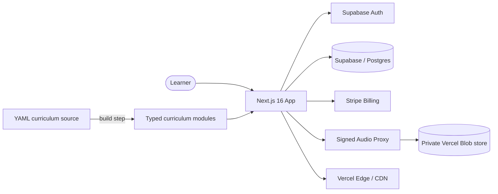

<h1 align="center">Francaisia</h1>

  <strong>French-learning platform for Canadian immigration.</strong> 
  TEF Canada prep for Express Entry candidates targeting CLB 7 / B2.

  
  

  
  
  
  
  

---

  <em>↓ 
 ↓</em>

## What it is

Francaisia is a premium TEF Canada preparation platform for Express Entry candidates who need to prove French proficiency at CLB 7 / B2. It covers the full A0→B2 path with an immersive, gamified lesson player and a science-based methodology — spaced repetition, comprehensible input, the testing effect, and shadowing.

Unlike generic language apps, it's built around the four mandatory TEF Canada components (reading, listening, writing, speaking) and a continuous narrative arc that carries the learner across every level.

## Features

- **90+ lessons, A0 → B2**, structured into five themed "worlds" with mini-TEF mock exams as level checkpoints.
- **Six-stage immersive lesson player** — Story → Teach → Example → Try → Apply → Lock In — so every lesson moves from input to active recall.
- **Fully voiced narrative** — hundreds of neural TTS audio clips delivering a continuous story arc across the curriculum.
- **Gamified progression** — XP, gems, and a recurring mascot guide that ties the levels together.
- **Subscription billing** via Stripe, with gated content and account management.

## Architecture

The curriculum is authored as structured **YAML source files** and compiled into typed modules at build time — content stays version-controlled and reviewable, while the app consumes a fast, typed data layer. Audio is never exposed directly: clips live in a **private blob store** and are served through a **server-side signed proxy**.

## Engineering highlights

- **Server-side audio proxy.** Hundreds of TTS clips are stored privately and streamed through an authenticated proxy, so media URLs are never leaked to the client.
- **Build-time curriculum pipeline.** Lessons are written in YAML and transformed into typed TypeScript modules by a build script — single source of truth, no hand-edited generated files.
- **SSR-safe rendering.** Icon and theme handling designed to avoid hydration mismatches under Next.js App Router / RSC.
- **Stripe subscription lifecycle** wired end to end: checkout, webhooks, and content gating.

## Status

🔒 **Source is private** — Francaisia is a live product with active billing. This repository is a public showcase of the architecture and engineering. Try the real thing at **[francaisia.com](https://francaisia.com)**.

---

  Built by <a href="https://omarserrano.ca">Omar Serrano</a> ·
  <a href="https://www.linkedin.com/in/omar-serrano-b40b01216/">LinkedIn</a>

